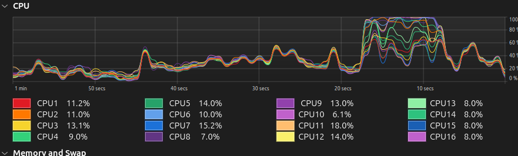

# Relatorio

## informações do processador:
13th Gen Intel® Core™ i5-13400F × 16 theads 

## informações do algoritimo:
O gargalo do algoritimo é o calculo da matriz de covariancia.

- codigo ANTES de paralelizar com OpenMP
```c
void covariance_matrix(double data[ROWS][COLS], double cov[COLS][COLS]) {
  for (int i = 0; i < COLS; i++) {
    for (int j = i; j < COLS; j++) {
      double sum = 0.0;
      for (int k = 0; k < ROWS; k++) {
        sum += data[k][i] * data[k][j];
      }
      cov[i][j] = cov[j][i] = sum / (ROWS - 1);
    }
  }
}
```

- codigo DEPOIS De paralelizar com OpenMP
```c
void covariance_matrix(double data[ROWS][COLS], double cov[COLS][COLS]) {
  // dynamic pois a computação é para j >= i, gerando um desbalanceamento da carga
  #pragma omp parallel for schedule(dynamic)
  for (int i = 0; i < COLS; i++) {
    for (int j = i; j < COLS; j++) {
      double sum = 0.0;

      #pragma omp parallel for reduction(+:sum)
      for (int k = 0; k < ROWS; k++) {
        sum += data[k][i] * data[k][j];
      }
      cov[i][j] = cov[j][i] = sum / (ROWS - 1);
    }
  }
}
```

## Tempo de calculo da matriz por número de theads X tamanho da entrada

### 50000 X 250
| num theads  | calculation time (s)|
| ----------  | --------------------|
| 1           | 9.8081              |
| 2           | 4.2340              |
| 4           | 1.9412              |
| 8           | 1.3842              |
| 9           | 1.2764              |
| 10          | 1.3913              |
| 11          | 1.5554              |
| 16          | 2.3159              |

### 100000 X 340
| num theads  | calculation time (s)|
| ----------  | --------------------|
| 1           | 56.6377             |
| 2           | 27.0792             |
| 4           | 15.6879             |
| 8           | 9.9704              |
| 9           | 8.3312              |
| 10          | 7.2001              |
| 11          | 8.3312              |
| 16          | 16.9015             |

### 150000 X 450
| num theads  | calculation time (s)|
| ----------  | --------------------|
| 1           | 120.4303            |
| 2           | 58.5744             |
| 4           | 42.7823             |
| 8           | 25.9403             |
| 9           | 22.4954             |
| 10          | 20.8916             |
| 11          | 22.1405             |
| 16          | 35.3043             |


